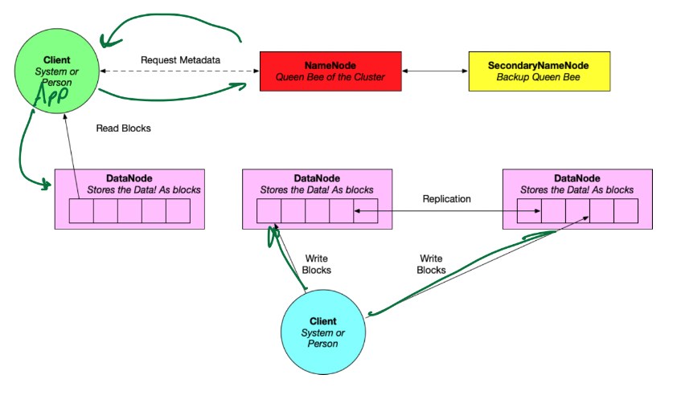

### Distributed Systems
- two main data system architectures:
- 1. **replication** - all nodes have exactly the same data
  - pros:
    - load balance
    - fault tolerace => high availability, mostly consistent
      - consistent means you always get the correct answer, or gets no answer (if correct one not avail)
      - availability means even if a system goes down you'll still get the answer from somewhere, but it might be outdated or incorrect
- 2. **sharding** - different nodes contain different data
  - pros:
    - low latency

### Big Data
- purpose a big data system is to maximize the usage compute resources to increase the amount of work we can do per unit time
  - big datasets do not fit in RAM on a single machine and require parallelism
- *parallelism does not make data processing faster, but increases throughput*
  - can get a result quicker
  - in some cases parallism can make processing slower due to overhead

### Hadoop Ecosystem
- 
- **Hadoop Distributed File System (HDFS) Infrastructure**
- 

### MapReduce
- 7 dataflow phases
- example: count word frequencies in english novels
- **Input**
  - *InputFormat* is the implementation of the input phase
  - specifies:
    - how records are laid out in files
    - how to divide groups of records into **splits**
      - splits are used to define parallelism and typically contain 1 block of data
      - each split defines a map task
  - 
- **Map**
  - 
  - 
- **Partition**
  - need to group key-value pairs by key
    - each key-value pair is assigned to a partition using a hash function applied on key, then a modulo based on number of reduce tasks
    - thus all key-value pairs with same key is sent to the same reducer task in reduce phase
  - 
    - all of this is called the *map side*
  - each partition is then shuffled across the network to reducers
- **Shuffle**
  - 
- **Sort**
  - sort key-value pairs by key
  - values are then grouped by key:
    - `(key, [list of values])`
  - 
- **Reduce**
  - each reducer executes a *reduce* function
    - in word counts example, it's the sum function
  - note that a given reducer may act on key-value pairs that come from different mappers
- **Output**
  - write `(key, frequency sum)` outputs to a file
  - each reducer outputs a single files
  - can use an **OutputFormat** if we want to store output in another format such as delimited, Parquet, binary, etc

### Map Reduce Summary
- 
  - shuffle moves data from map side to reduce side
- MapReduce functions on each input split *independently*
  - splits control which mapper each record goes to
  - k-v pair from map phase controls which reducer operates on it
- MapReduce is a **shared-nothing** model
  - also *embarrassingly/pleasingly parallel*
- MapReduce doesn't require a full big data infrastructure like Hadoop
  - can be implemented in functional languages such as ML or Haskell
  - can also combine mapper and reducer code via Unix pipe
    - e.g. `cat record1 record2 | mapper.py | sort | reducer.py`

### SQL in MapReduce
- 
- SQL operations can be performed using combinations of map and reduce phases
  - relational algebra select (SQL WHERE):
    - filter rows / key-value before shuffle (map-side)
  - aggregation $\gamma$:
    - GROUP BY: partition OR sort (map-side)
    - aggregation function: reduce!
- SQL queries are correspond directly to MapReduce
- subqueries spawn sub-MapReduce jobs, which encourage parallelism
- **Apache Hive** - uses SQL as a "relational language" on top of MapReduce and HDFS
  - not RDBMS but sometimes used as DW
- **Apache Pig** uses a declarative language called Pig Latin for the same
  - more closely resembles relational algebra

### Apache Spark
- think of our pipeline as a series of *algebraic* steps that take as input as well as output arbitrary data
- instead of relations, Spark uses **Resilient Distributed Datasets (RDDs)** as input and ouput to/from operators
  - 
  - higher levels of abstraction than RDD exist now
    - but RDDs still useful when data is unstructured / schemaless
- data in Spark is treated as a single data structure as if it's on one machine
- advantages of Spark over Hadoop:
  - 
  - a lot faster than Hadoop
- **Transformations and Actions**
  - 
  - 
    - actions execute the DAG
- other advantages of Spark:
  - 
- Spark core executation model
  - 
- Spark word counts
  - 
- Spark computation of $\pi$
  - 

### Spark SQL
- Spark uses the idea of MapReduce but not the implementation
  - some Spark operators are built on top of Hadoop and MapReduce, but it is all abstracted away from user
- Spark is NOT an RDBMS
  - so Spark SQL is not as sophisticated as RDBMS
    - joins are the biggest source of poor performance in Spark
- Spark provides a relational layer on top of data in HDFS
  - data in Spark SQL is represented as a DataFrame (looks like a table)
- example in python
  - 