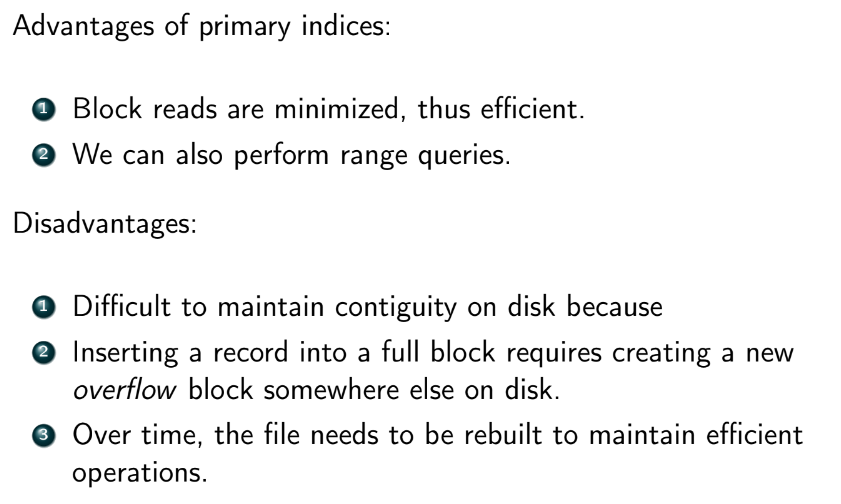

### Storage Engine
- **storage engine** (or storage manager) is responsible for storing, retrieving, managing data in memory/disk
  - most optimize data storage for *rows*
  - some database systems store data entirely in RAM (redis), others use both disk and memory
    - disk very slow
  - tradeoffs
    - speed
    - cost
    - data reliability
  - disk is either SSD OR HDD

### Data Storage Methods
- **main memory / RAM**
  - fast but expensive
  - fastest random access (RA)
  - *volatile* - lose data if powered off
- **solid state / flash**
  - faster than HDD
  - expensive (but not as much as RAM)
  - fast RA
  - nonvolatile
- **magnetic disks / HDD**
  - very cheap but very slow
  - nasty failures
- **optical media / CD / DVD / floppies**
  - very slow
- **tape storage**
  - snail slow
  - dirt cheap
  - only sequential access
  - very stable
- **cloud storage**
  - variable

### Hard Disks (HDD)
- **anatomy**
  - 
    - heads float above disks
      - if they touch (called a *head crash*) it can scratch the disk
    - if HDD fails you can recover the data physically (can't do this with SSD)
- **performance**
  - many metrics
  - *access time* - time from r/w request to the time transfer starts
  - *seek time* - time from head to move from parked stage to a particular sector
  - *rotational latency* - time it takes to find a sector (assuming head is already on a track)
  - *data transfer rate* - time to transfer a sector to RAM
    - depends on the interface, e.g. SATA
  - *MTBF* - mean time between failures
- **hard disk organization**
  - data on disk addressable by **blocks**
    - not bits or bytes
  - goal: minimize block transfers between disk and RAM
- **data access**
  - *sequential* - access blocks in a predetermined order, usually contiguously
    - HDD good at this
  - *random access* - target blocks are distributed all over disk and not in a particular order
    - SSD good at this
- **techniques to avoid data swapping (between RAM and disk)**
  - *caching / buffering* - read blocks into a buffer; evict when full
    - databases use the MRU (most recently used) eviction policy
  - *read-ahead* - a request for $b_i$ also fetches $j$ the contiguous blocks after it (in case we need it soon)
  - *scheduling* - group r/w requests by cylinder
  - *file organization* - how records/blocks are stored in disk
    - 
      - NULL bitmap tells you which records are NULL
    - DB maps reocrds into blocks, into files
    - 1+ records fit in a block
    - 1+ blocks form a file
    - $records\subseteq blocks\subseteq files\subseteq relation$
    - records in distinct tables will have different sizes
      - two ways to store records into files
        - assume all records are the same length
          - easy to find the $k$-th records
          - two problems:
            - what if block size is not a multiple of record size?
              - we'd have to use a new block and waste some space
            - what happens when we delete records?
              - records ordered in linked list so first change pointers
              - keep track of an empty_record linked list so you know where you can fill in
            - if the block where you need to insert record (for preservation of sequence) is full, put record in overflow block
              - from time to time reorder records so they are again sequential
        - allow records to differ in length (**slotted page**)
          - create a table of records that points to variable-sized attributes
            - each entry is the form of (offset, length)
          - followed by the data for fixed-size attributes, the null bitmap, then finally data for variable-sized attributes
      - 
    - *organizing orecords into blocks*
      - each block has a header that contains:
        - num records in the block
        - location of end of free space in block
        - location and size of each record
      - 
  - *non-volatile write buffers*
    - if there are lots of writes, we might have to wait before we can write the block to disk
    - queue it in non-volatile RAM (NVRAM) while waiting
      - if power outage occurs, the queue can still persist for a little and be written to disk successfully
    - if NVRAM fills up the DB will block

### Indexing
- a full table scan is slow, must do better
- 
- **index** - enables fast lookups
  - given a search key, an index gives you the block addresses + offsets of relevant records
    - search key can be anything (not necessarily PK, CK, etc)
  - if index fits in RAM we must read it into RAM first 
- metrics for indices
  - access time - equality or range search?
  - access/search time
  - insertion time
  - deletion time
  - space overhead
- **Ordered indices** - based on a sorted ordering of the sort-key values
  - *ISAM* - Index Sequential Access Method
    - was revolution and very simple to implement
      - but has limitations that have caused its deprecation
    - good at first when data is stored contiguously
      - but over time there may be many overflow blocks which slows things down
  - *primary (clustering) vs secondary (non-clustering)*
    - 
      - primary index usually associated with PK
      - pretty fast
      - if there are multiple records with the search key, index only points to the first one
        - then search data sequentially to find all of the matching records
      - 
      - *secondary* - data file is sorted by some search key different from the one used to create the index
        - the index has a linked list for each search key
          - linked list contains pointers to all duplicate values of the search key in the data
        - can only be dense! since data file not sorted by the search key
  - *dense vs sparse*
    - *dense* - every value of the search key in the records is in the index
    - *sparse* - only some of the possible key values in the records in is the index
      - follow the greatest index that is smaller than the search key than scan downward until target is found
      - pro: can more likely read index into RAM
      - con: more block transfers when searching for target block
      - how to pick the keys that appear in the sparse index?
        - goal: minimize block transfers
        - so pick first search-key in each block
  - **B+ Tree**
    - 
    - 
      - only stores index, NO DATA
    - 
      - order of insertion matters for what tree looks like
    - 
    - traversal times, given $t_S$ seek time and $t_T$ transfer time
      - traversing a level: $t_S+t_T$
      - traversing one leaf node to the next: $t_T$ (for primary)
      - fetching a record $t_S+t_T$
    - search time: $h(t_S+t_T)$
    - inserts/deletions complexity is $O(\log_{ceil(n/2)}{H})$
    - 
- **Hash indices** - based on a uniform distribution of values across a range of buckets
  - random access (similar to hash table)
  - great at answering equality queries, but no so much at answering rnage queries
    - since keys are not stored in a consistent order
  - xzx