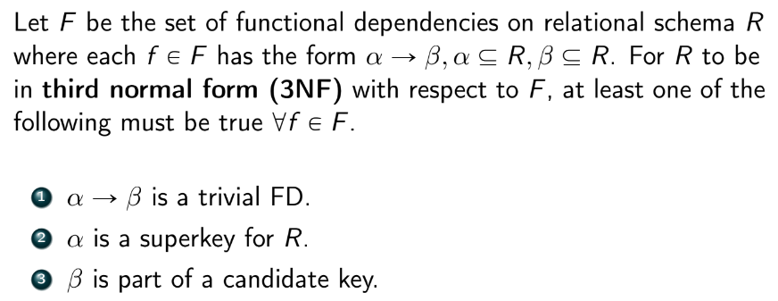

### Normalization
- *the process of refactoring tables to reduce redundancy in a relation*
  - involves splitting a table with redundant data into two or more non-redundant tables
  - separates concerns in DB
  - prevents data integrity issues / anomalies on insert, delete, and update (due to dependencies between the redundancies)
    - insert: might have NULL cols (e.g. videos that don't have comments)
    - update/delete: have to update/delete more times for each redundant row
  - allows us to query over columns that actually matter
- tables without redundancies are called **normalized**
- when there are redundancies in a table, we can **decompose** the table using **functional dependencies**
- Q: are there cases where denormalized tables are good?
  - yes! e.g. read-heavy table when we don't have to worry about timeliness
    - this is how data warehouses work

### Functional Dependencies
- given a relation $R$ with sets of attributes $X,Y$, $X$ **functionally determines** $Y$ iff each value of $X$ is associated with *exactly one* value of $Y$
  - i.e. for all tuples $t_1,t_2\in R$, $$X\to Y\iff t_1[X]=t_2[X]\text{ implies } t_1[Y]=t_2[Y]$$
  - notated $X\to Y$
  - aka uniquely determines, uniquely defines, identifies, maps to
- **Heath's Theorem**
  - if a relation $R$ over attribute set $U$ satisfies functional dependency $F:X\to Y$, then $R$ can be split into two smaller relations $R_1,R_2$ satisfy the *lossless-join decomposition property* $$R=\Pi_{XY}(R_1)\bowtie \Pi_{XZ}(R_2)$$ where $Z=U-XY$ are the rest of the attributes
  - i.e. if $X\to Y$ then we can split a table into two
    - 1. XY
    - 2. X and everything else except for Y
    - X is the join key
  - example:
    - 
- **Properties of Fundctional Dependencies**
  - **Armstrong's Axioms**
    - *Reflexivity* - if $B\subseteq A$ then $A\to B$
      - e.g. $A\to A, AB\to A$
    - *Augmentation* - if $A\to B$, then $AC\to BC$
    - *Transitivity* - if $A\to B$ and $B\to C$, then $A\to C$
  - *Union* - if $A\to B$ and $A\to C$, then $A\to BC$
  - *Composition* - if $A\to B$ and $C\to D$, then $AC\to BD$
  - *Decomposition* - if $A\to BC$, then $A\to B$ and $A\to C$
    - the inverse of Union
  - *Pseudotransitivity* - if $A\to B$ and $BD\to C$, then $AD\to C$
- **Canonical Cover**
  - the set of all functional dependencies is $F^+$
  - *canonical cover* - a basis/minimal set $F_c$ (not unique) that is equivalent in implication to $F+$
  - *summarizes all FDs in a relation*
  - like a basis for FDs
  - algorithm to find basis:
    - 1. create singletons of the form $XYZ...\to A$ using decomposition
    - 2. remove extraneous attributes/FDs
      - e.g. if we have $A\to C$ and $AB\to C$, we can get rid of the latter
      - now the set is mostly in the form $A\to B$
    - 3. remove inferred/redundant FDs
      - e.g. if an FD can be formed by two other FDs via transitivity, remove it
    - 4. clean up with Union
    - 5. repeat until FD set is stable
  - algo restated:
    - 

### Normal Forms
- *a metric  for measuring whether a particular schema is in a good form*
- **First Normal Form (1NF)**
  - satisifies all of the following:
    - flat and simple (no nesting/collections)
    - no repeated groups
      - i.e. nonsense ordering of columns
      - e.g. cols class1, class2, class3 that an instructor is teaching
    - there is a unique key
    - no null values
  - "all non-key attributes depend on a key"
  - to conver to 1NF:
    - add primary key
    - remove/handle NULLs
    - *explode* collections into more rows
- **Second Normal Form (2NF)**
  - a relation $R$ is automatically in 2NF if it does not contain any composite keys and is in 1NF
    - otherwise $R$ is in 2NF iff every attribute $A\in R$ satisfies *either* of the following:
      - $A$ appaers in a candidate key
      - $A$ entirely depends on an *entire* key
        - i.e. $A$ is not partially dependent on any composite candidate keys
  - "each attribute depends on the key, the whole key"
- **Third Normal Form (3NF)**
  - a relation is in 3NF if it is in 2NF AND:
    - all attributes that are not part of any candidate key (called non-prime attributes) must depend only and directly on the candidate key(s) and nothing else
      - i.e. transitivity is not allowed
      - i.e. no non-prime attributes can depend on some non-key attribute
  - trick: if all attributes in $R$ are part of a candidate key, then $R$ is automatically in 3NF by definition
  - "all non-key attributes depend on a key, the whole key, and nothing but the key"
  - **theoretical definition (Zaniolo)**
    - 
      - #3 distinguishes 3NF from higher order normal forms
  - in practice, 3NF is usually good enough
- **Boyce-Codd Normal Form (BCNF / 3.5NF)**
  - 
  - **decomposing to BCNF**
  - 
    - decompositions are NOT unique
      - some may be dependency preserving, some may not be
  - *trick:* any relation that only contains 2 attributes is in BCNF
  - very few 3NF are not in BCNF
    - typically happens when CKs overlap
- as NF incr, redundancy decr, but data integrity also might decr

### Lossless Decomposition
- if we decompose $R$ into $R_1,R_2$, we want $$R_1\bowtie R_2=R$$
  - a consequence of this is $$|R_1\bowtie R_2|=|R|$$
- *lossless decompositions* satisfy the following:
  - 
    - #1 checks that we don't lose attributes by decomp
    - #2 checks we have attributes in common (the join key)
- two ways to test for losslessness:
  - 1. test $R_1\bowtie R_2=R$
  - 2. test the 3 conditions above
- all decompositions into 1/2/3/B/4NF are lossless
  - but 5/6NF are not guaranteed to be lossless

### Attribute Closure
- for any set of attributes $A\subseteq R$, the **closure** of A is all of the attributes in $R$ that can be derived by the functional dependencies of $R$
  - notated $A^+$
- uses of attribute closure:
  - 

### Dependency Preservation
- when we decompose $R$ into subrelations, we want functional dependency contraints to still hold (for data integrity reasons)
  - most obvious way to see a dependency is preserved is to see if both left and right sides are contained in a single subrelation
- need to check that all FDs in $F$ can be derived from FDs that hold on each subrelation $$(F_1\cup\dots\cup F_n)=F^+$$ where $F_i$ the set of FDs that hold on subrelation $R_i$
  - 
- attribute closure algo (Ullman)
  - 
- only normal forms up to and include 3NF guarantee dependency preservation

### The Point
- when designing DBs, we want it to be BCNF, lossless, and dependency preserving
  - sometimes not possible to get all 3, so may use 3NF is we want to guarantee dependency preservation