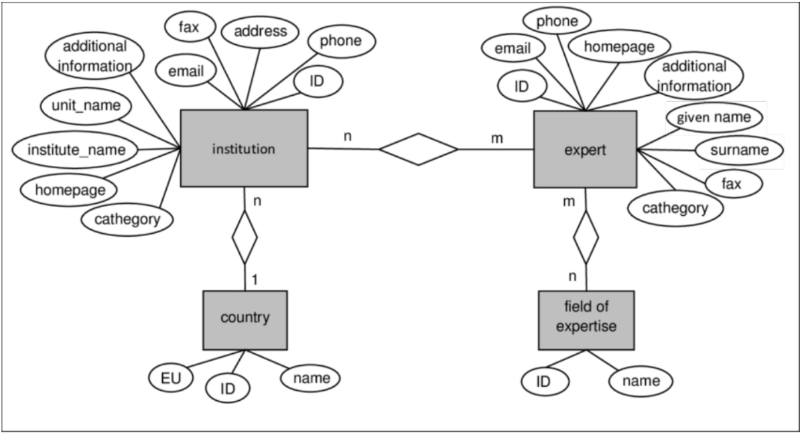

### Flat Files
- problems:
  - data integrity and redundancy
    - difficult to enforce constraints on data
  - sysadmin is a bottleneck
  - lack of atomicity
  - concurrent access
  - security

### Databases
- **RDBMS** - Relational DataBase Management System
- purpose of database:
  - abstracts away how data is stored, maintained, and processed
    - view, add, update, and delete data w/o data integrity
  - a system that stores/indexes data through advanced data structures
  - provides ONE single location for all data (although the data may be physically distributed over multiple nodes)
- *centralized database* - admin has all the power
- *blockchain* - all nodes in system cooperate to make sure database is consistent (helps w/ security)
- Git and blockchain both use merkle chains as underlying data structure
- **Levels of Abstraction**
  - *Physical*
    - how data is stored on the disk and accessed
    - e.g. MySQL has 9 storage engines, while PostgreSQL has only 1
  - *Logical*
    - what data is stored, how it is represented, and what relationships exist between them
    - essentially how to use database
  - *View*
    - highest level of abstraciton and refers to specific use cases
    - e.g. the result of a complex SQL query for a specific problem
- *schema* - the overall design of a database

### Data Models
- define how we design databases or interact with data
  - *implementation* - database built with a specific model from the ground up and cannot be reconfigured to do anything else
  - *design mechanism* - the way to describe/visualize database
  - there are 8 major types
1. **Relational Model**
   - data stored as a *relation*
   - rows are individual units called *tuples*
   - columns are *attributes* common to all records
     - attributes have types
2. **Entity-Relationship (ER)**
   - 
   - uses a collection of objects called *entities* and relationships among them
   - not a database implementation, but rather used for database design
   - good for visualization but can get cluttered if model is big
3. **Objecte-Oriented**
   - originally for implementation, now a design mech
   - data treated as instances of classes
   - ORM
   - more rare
4. **Document (Semi-Structured)**
   - individual data objects may have different sets of attributes
     - records may not share core set of attributes
   - e.g. JSON and XML
   - most are like NoSQL
5. **Network/Hierarchical/Graph**
   - predates all other models
   - defines data records as nodes, and relationships between them as edges
   - a notable NoSQL examples is neo4j
6. **Vector Database**
   - stores fixed-length numerical vectors
   - each vector or group of vectors may have associated metadata
   - indexed by metadata or *nearest neighbor* properties
   - allows for fast retrieval of vectors that are nearby to each other
   - con: not very human-readable
7. **Key-Value**
   - lookup is very fast
   - data typically resides in RAM, not disk
   - difference from document is that there is no structure
8. **Hybrids / Multi-Models**

### Database Languages
- two main semantic systems for working with databases
  - data definition language (DDL)
    - specifies a schema
      - collection of attribute names and data types
      - consistency contraints
        - domain constraints - data type constraints
          - tinyints, enums
        - referential integrity - foreign/primary key consistency
        - assertions - business rules / policies coded into database
        - authorization - who can do what
      - storage structure and access methods (optional)
  - data manipulation language (DML)
    - *procedural* - user specifies what data is needed and **how** to get it
    - *declarative* - user specifies what data is need but NOT how to get it (system figures it out)
    - SQL is declarative
      - since SQL is not procedural, it is not good at sequential compuatations, or any computation where the user specifies how to perform computation
      - **ETL** - used when SQL is not enough
        - Extract data from database using a database connection driver
        - Transform the data (parse, reformat, aggregate, etc)
        - Load data into new table using same driver
    - **query** - an expression to retrieve or manipulate data

### Data Storage and Querying
- databases have a *storage manager* that allows us to not worry about how underlying data is laid out
  - most of data cannot fit into RAM, so it must be read efficiently from the disk (enabled by virtual memory)
- hashtable, BST, tries enable fast lookup
- *query manager* - the DML (i.e. SQL) statements organized into a query plan that consists of low-level instructions that the query evaluation engine understands to perform some operation on the data