### NoSQL Definition
- NoSQL refers to two separate concepts
- 1. a database system where the DML and DDL is something other than SQL
- 2. a database system that does not use the *relational model*, e.g. document stores, graph db, key-value stores
- most NoSQL DBs are distributed
  - makes use of *replication* and *sharding*
    - usually sharded and each shard is replicated

### CAP Theorem
- 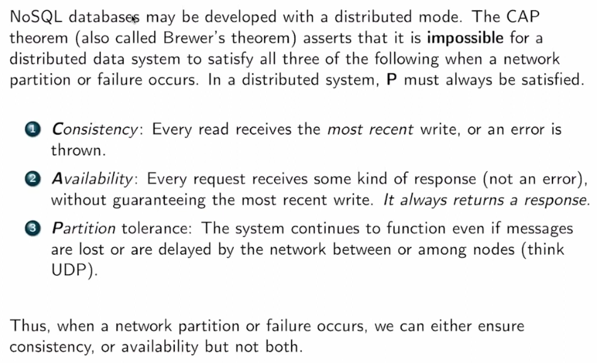
  - consistency is about up to date data
    - system blocks (waits) for the correct data, and if can't get it then throw error
    - good for DBs
    - but not important for apps like social media
  - availability means you always an immediate answer
    - but might not be the correct answer
  - often used inccorectly
    - not usually correct to say "mongoDB is CP/AP"
      - depends on config!
      - determined by how system behaves during a netowrk partition even (P) where parts of system cannot communicate with another
        - sacrifice avail or consistency?

### NoSQL Data Models
- 
- **key-value stores** - a database that implements a hash table
  - Redis is the most popular key-value store
    - stands for REmote DIctionary Server
  - 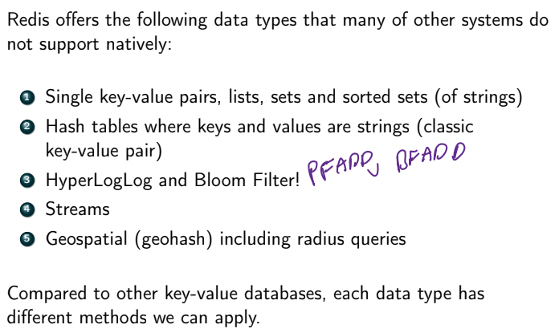
  - Redis usually operates in single node config
    - CAP doesn't apply since not distributed
    - but has cluster configs (some in AP some in CP)
      - Redis as cache: AP
  - uses cases include:
    - session caching (big one)
    - message queues
    - leaderboards
    - fast lookup and indexing
- **columnar datastore**
  - similar to relational model except each row can have different numbers of columns
    - i.e. fixed # of columns but each row may only use a subset of them
    - adding columns is easy
  - popular columnar stores
    - DuckDB - OLAP DB
    - HBase - based on MapReduced
      - can store *any* kind of data
      - designed for data lakes and analytics
      - CP - need consistent reads/writes
    - Cassandra - requires specific structure
      - designed for *always-on* operation (e.g. powering web/mobile apps)
        - AP
      - every node is equal (no master/workers)
        - **gossip protocol** - every node passes messages to each other
          - guarantees *eventual consistency*
      - each row has a key and series of columns
        - each column has name, value, and timestamp
        - set of column names fixed by schema
        - each row can have diff columns
      - 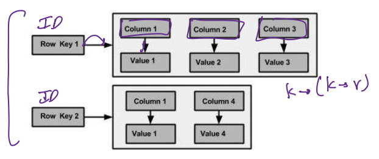
      - differences from RDBMS
        - designed to be *unnormalized* for fast lookups
          - can be used as data warehouses
        - no joins or subqueries
        - no FK (only PK)
        - rows are not ordered in theory (but ordered in practice)
- **document store**
  - system ingests full documents of info in a particular format (JSON/BSON)
  - MongoDB is the most popular
    - allows user to create multiple DBs
      - w/in each DB there can be multiple *collections* of documents
      - documents are *schemaless*
      - documents can be nested in each other (subdocuments)
    - documents $\subseteq$ collections $\subseteq$ databases
    - example MongoDB query:
    - 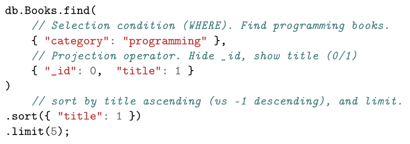
    - aggregation example:
    - 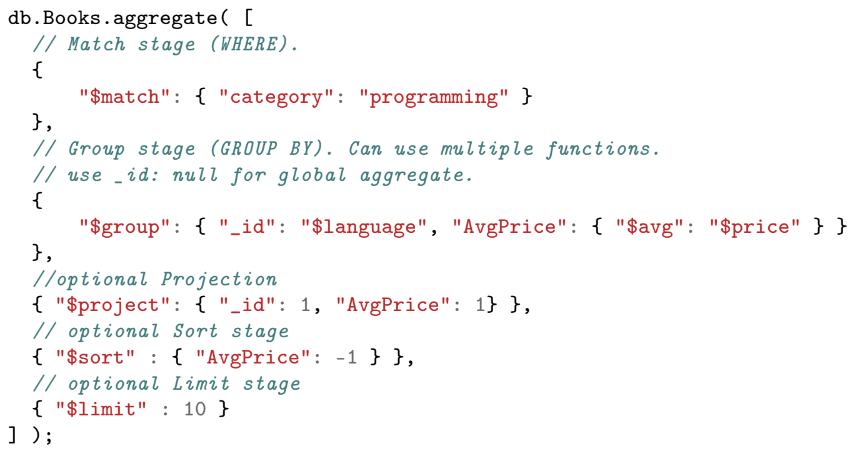
      - to group by multiple fields, use a subdocument
      - to group by all fields, use `"_id"=null`
    - mongoDB vs RDBMS
      - mongo has no joins
      - lots of redundacy (no concept of normalization)
        - all related data remain together
        - link to other documents via object IDs, or just subdocuments
      - no schema
      - data is just big JSON blob
      - has internal MapReduce to distribute embarrassingly parallel computations
    - mongo's distributed arch
      - 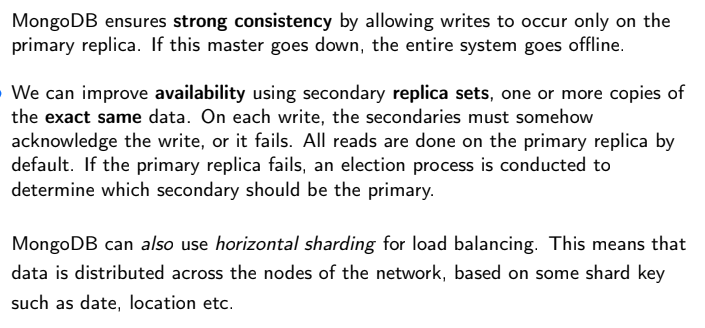
      - so by default config, mongo is CP
    - **ODM** (object document models) - is an API that allows users to use functions calls to access a document store
      - like an ORM (which is instead for relational models)
      - OxMs support CRUD operations
        - Create, Read, Update, Delete
- **graph stores**
  - *neo4j* is the most popular
  - 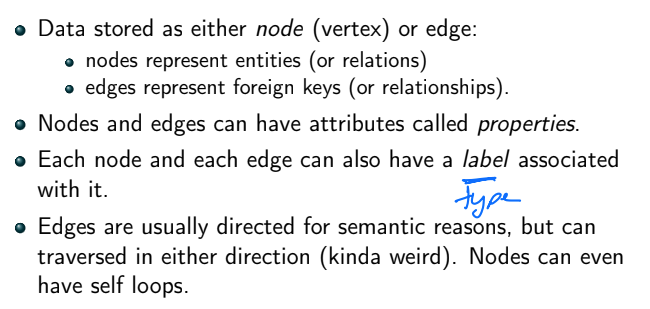
  - 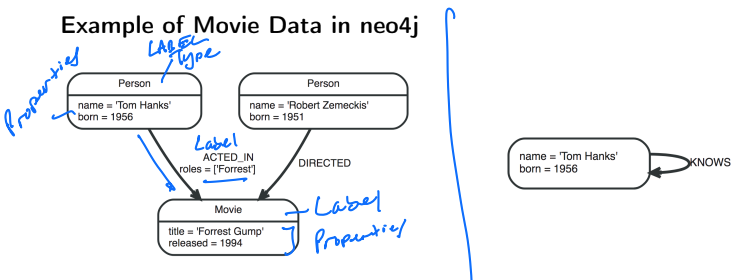
  - Cypher is a querying language (DDL/DML) used for graph stores
    - MATCH specifies a node(-relation-node) pattern for pattern matcing
    - WHERE is similar to SQL WHERE, but applied to properties of nodes/relationships
    - some examples
      - 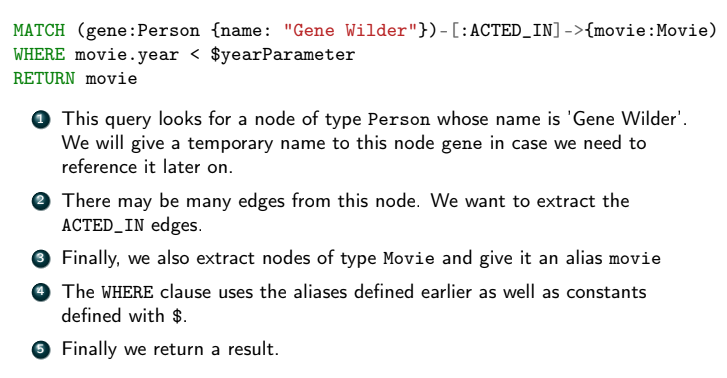
      - 
      - 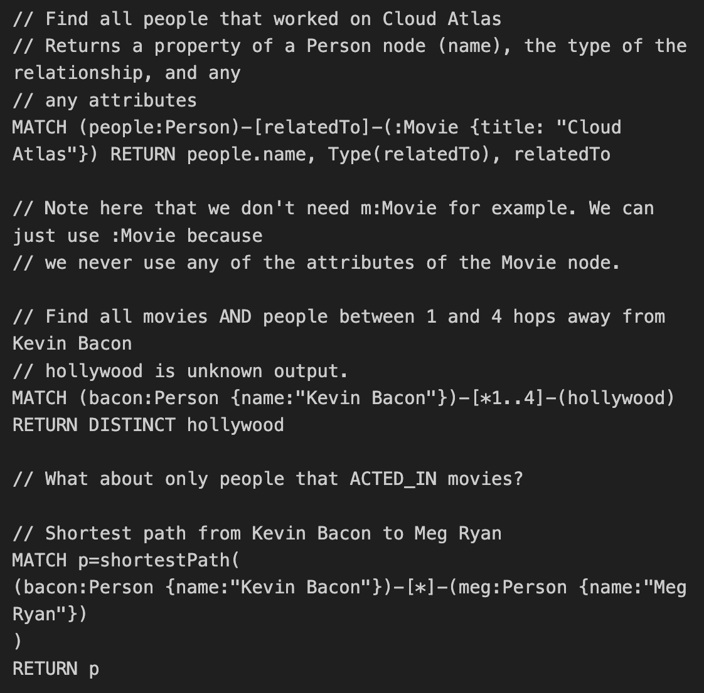
  - neo4j vs RDBMS
    - 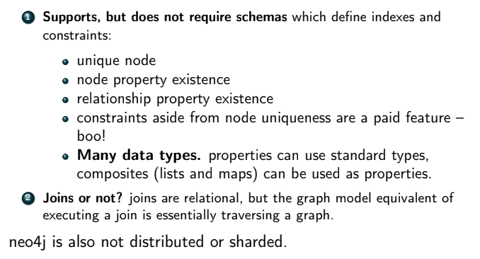
      - not distributed due to clustering
        - as clusters grow we may run out of space on a node, but how to split up cluster and remain efficient?
        - CAP does apply bc not distributed
    - constraints
    - 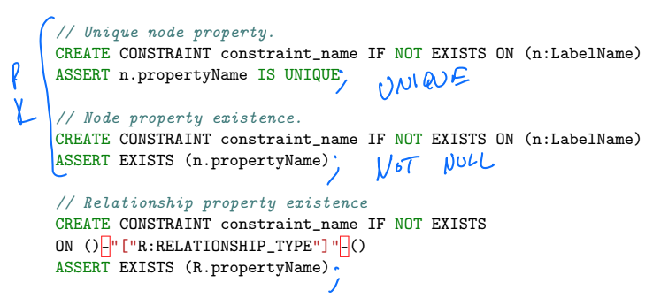