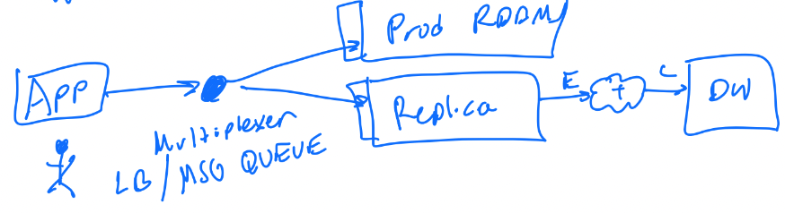
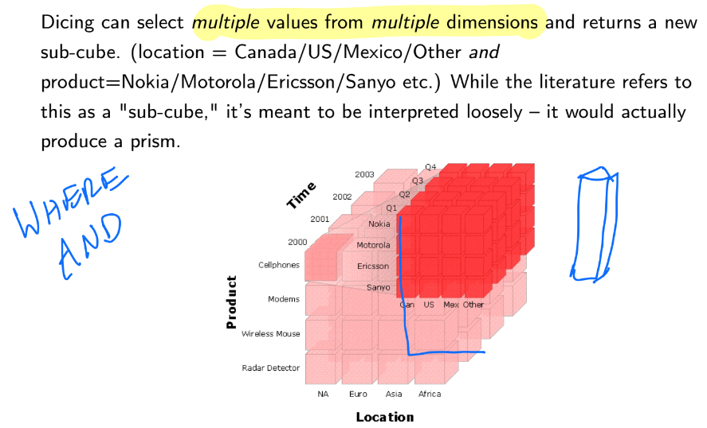
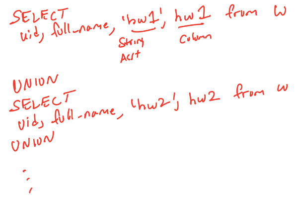
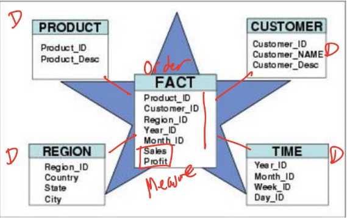
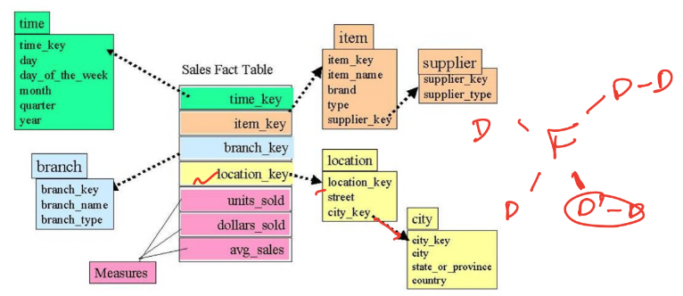
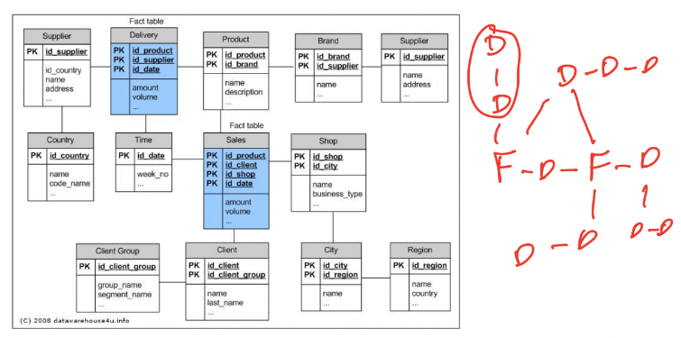
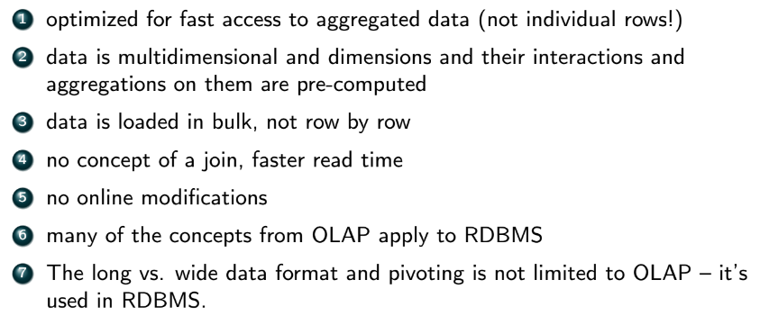
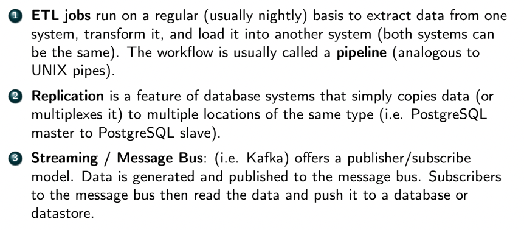
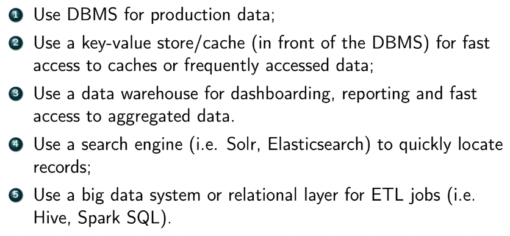
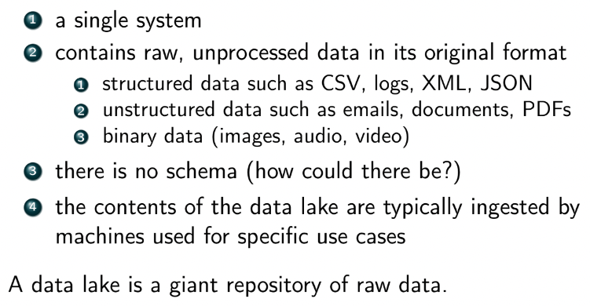

**Online Transaction Processing (OLTP)**
- OLTP - designed for frequent interactive use and optimizes many *random* reads and writes with low latency
- and used in production
  - each of these reads and writes is a result of some *transaction* carried out by a user
  - production means app or business (opposed to internal use / analytics)
  - 
- Postgres and other RDBMS are OLTP

### Online Analytical Processing (OLAP)
- not meant to be accessed in production, and only by internal users
- *read-only*
- optimized for very fast, low latency reads
  - random or incremental writes are slow (so better to write in batch)
  - data in OLAP are usually aggregated or precomputed data
    - easy to SELECT from and read
    - dimensions (groups) and aggregate function can be specified a priori by a data engineer, or automatically inferred by the system to make all possible groups ($2^n$ dimensions)
  - data in OLAP can also be *exploded* (denormalized) tables for fast reads
    - joins are computed as the data is inserted
    - one place where denormalized tables are good
    - data might be slightly out-of-date 
- users include some negineers, data scientists, business analysts, and other systems
  - users do NOT write ad hoc (randomly) into the system like OLTP
  - typically data is loaded into the data warehouse using an ETL job during low usage period (overnight)
    - extract from DB, transform, then load into DW
      - extraction from DB can be very costly on the DB
        - if production DB, may cause app to go down
        - sol:
        - 1. run ETL against a replica
        - 2. dual writes: on each write to the DB write to the replica 
        - 
    - ETL either transfer *all* of data or only the new data since last update
- note: OLAP and DW is completely different system than RDBMS/OLTP (diff use cases)
  - but both still typically use SQL
  - use cases:
    - reporting
    - dashboarding
- conceptually OLAP is visualized as a cube
  - but user still sees and works with tables
  - 
  - in reality there is usually >3 dimensions, resulting in a *hypercube*
- 
- 

### OLAP Operations
- **Slice**
  - 
- **Dice**
  - 
- typically the distinction between slice and dice are rarely made
  - usually only the term "slice" is used 
- **Rollup**
  - 
  - ROLLUP() in SQL
    - 
    - output:
    - 
- **Drill Down**
  - 
  - drill down thru hierarchies to a finer one
- **Pivot**
  - 
  - **wide format** - involves multiple *columns*
    - pros:
      - less redundancy
      - easy to understand
      - common in spreadsheets
    - cons:
      - NULLs
      - format is inflexible
        - e.g. have to alter table if we add HWs
  - **long format**
    - common in software engineering
    - pros:
      - flexible (easy to add another HW)
      - no NULLs
    - cons:
      - redundancy
      - harder to understand
  - **long to wide conversion**
    - 
    - 
  - **wide to long conversion**
    - 
  
### Schemas in Data Warehouses
- types of tables in DW
  - **fact table** - contains quantitative data to be analyzed
    - typically denormalized
    - e.g. trainsuid (key), revenue
  - **dimension table** - contains data about attributes of each of these facts
    - e.g. customer info for transaction, metadata
- **Star Schema**
  - contains a single fact table and several dimension tables that must be joined to it to get a result
  - 
- **Snowflake Schema**
  - has a central fact table, and several dimension tables that must be joined to each other to get a full result / describe the fact
- 
- **Galaxy/Constellation Schema**
  - contains multiple fact tables that share some dimension tables among them
    - closest to RDBMS
  - 

**Summary of OLAP**
- 

**Data System Architecture**
- usually there are multiple copies of the same database
  - most commonly:
    - *production database* - for apps, not humans
    - *development database* - used to test new features or process diagnostics
    - a replica for heavy reads
  - synced with either a nightly job (ETL), a message bus that multiplexes data ops, or using advanced replication options in RDBMS (e.g. PostregreSQL supports replication)
  - 
  - 

### Data Lakes
- an architecture where data is stored in multiple data storage systems and in different formats
  - can be queried from a single system
  - an alternative to DW
    - do not require up-front effort to preprocess data, but more effort when creating queries
  - 
- **Hadoop Distributed File System (HDFW)**
  - the most successful implementation of data lake
  - highly scalable distributed file system that allows user to store any kind of raw data
    - adding more storage via disks/nodes is easy
  - has redundancy and authorization model
  - allows multiple nodes to read data from it
  - powers Hadoop Map-Reduce
  - a storage option for Spark