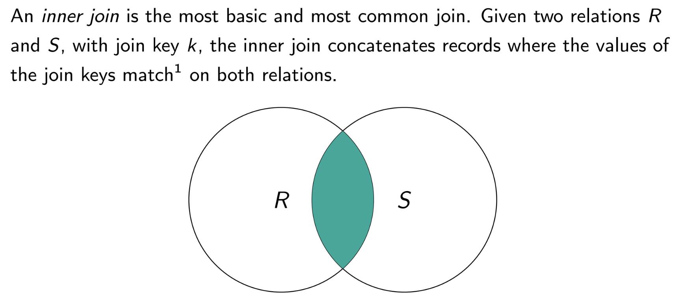

### ANSI SQL Data Types
- **numeric**
  - int
  - smallint
  - numeric(p,d) - fixed point number which contains p digits, d of which comes after the decimal
  - real, double precision
  - float(n) - floating point number with precision of at least n digits
- **string/text**
  - 
- **binary**
- **date/time**
  - 
- **null value**

### PostgreSQL Data Types
- integers
  - 
  - we want to be efficient to save space and plan for future use
  - want to start with smaller types and *promote* types to increase precision if needed
    - never *demote* which may limit precision
- fixed-point
  - DECIMAL(p, d) - fixed point number which contains p digits, d of which comes after the decimal
    - aka numeric
    - p is called precision, and d is called scale
  - NaN
    - NaN == NaN is true
    - NaN greater than all non-NaN values
  - decimal/numeric is slow
- floating point
  - real and double precision
  - 
- strings
  - char(n) and varchar(n)
    - char(n) will always use up n characters
    - but varchar(n) will only take k character storage spaces if you store a k character-length string
  - n is counted in characters, not bytes
- binary
  - bytea
  - bit(n)
  - accepts hex or escape format
- boolean
  - TRUE, FALSE, or NULL
  - 
- date and times
  - 
  - 
- enums
  - 
  - properties
    - 
- geometric/spatial types
  - 
  - use case examples
    - 
- JSON/XML as extra storage
  - in schema you can add an extra attribute that is a JSON blob
    - in this way you can insert any data related to a row but doesn't fit in the schema
- **Casting**
  - use `::` operator to cast values to another type
  - `gpa::decimal(4, 3) AS gpa`

### Database Management
- **Creating a Table**
  - syntax: CREATE TABLE
  - example:
    - youtube_video relation
      - upload date: timestamptz
      - video length: interval
      - description of vid: text
      - flag indicating if vid is public/public/unlisted: enum
      - video content itself: bytea
      - extra fields: jasonb
      - user location as lat/lon: point
    - 
      - likes/dislikes/views should be: NOT NULL DEFAULT 0
      - privacy should be NOT NULL as well, or else the user can modify existing privacy attributes to NULL
      - if only one primary key, you can specify it in-line (e.g. next to video_id)
      - note: foreign key syntax!
        - must refer to an existing table
      - ON DELETE CASCADE, ON UPDATE CASCADE
        - specified on the foreign key
        - when primary key in referred table is deleted/updated, the changes are casacded to rows in this table too
    - use keyword UNIQUE to ensure no duplicates in column
    - inline ver.
    - 
- **Database CLI / Shell**
  - most common for PostgreSQL is `psql`
  - common `psql` commands:
  - 
- *database* - forms physical partitions between unrelated data
  - relationships between any two databases are not allowed (unlike MySQL)
- **schema** - collection of tables that have similar use cases
  - you can join within and across schemas
- **Changing a Schema**
  - great care must be taken in designing database or table schema because it can be very inefficient to change them later
  - some rule of thumbs:
    - 1. promote never demote
    - 2. don't delete columns - just abandon
      - can be nulled out or just don't use
    - 3. never add columns
      - either create extra col with JSON blob
      - or create a 2nd table with a join key
  - generally don't rename attributes
  - ALTER TABLE allows us to:
    - 
  - example:
  - 
    - DROP deletes column
    - ADD adds column
  - 
  - 

### Intro to SQL
- **SELECT**
  - results of SELECT are ephemeral
    - data in table is not changed
    - exception is SELECT INTO
  - example:
    - 
    - SELECT DISTINCT is like $\Pi$
    - WHERE is like $\sigma$ with condition $\psi$
  - SELECT DISTINCT to remove duplicates
    - note that the DISTINCT is distributed across all columns
- **Aliasing, Arithmetics, Functions**
  - 
  - if $f$ is a function, you can use $f(views)$ as well
- **WHERE**
  - uses the binary oeprators $=, \geq, \leq, <, >$, !=
  - connect predicates with AND, OR
  - can test set membership via IN, NOT IN
  - test for NULL using IS NULL, IS NOT NULL
  - acts on attribute values to filters rows
  - use BETWEEN to combine $\leq, \geq$
    - 
- **ORDER BY**
  - sorts the output by specified columns
    - 
  - defaults to sort by ascending order
  - can use DESC after colname, and LIMIT to truncate output
    - 
  - treatment of NULLs
    - add NULLS FIRST or NULLS LAST
    - NULLs treated larger than other values so NULLS LAST by default
- **GROUP BY**
  - does aggregation
  - two kinds of aggregations
    - 1. aggregate over entire relation
      - $\gamma_f(R)$
      - don't need GROUP BY keyword
        - 
    - 2. aggregate over a certain group
      - $_g\gamma_f(R)$
      - needs GROUP BY keyword
        - 
        - $_{major}\gamma_{AVG(gpa)\to average}(R)$
  - *syntax rule*
    - as soon as you invoke an aggregation, *every* column in the SELECT must be either in the aggregation function or in the GROUP BY
      - 
- **HAVING**
  - *very important*
  - post-filters the result of aggregations
    - cannot use WHERE in this case
    - WHERE is like a pre-filter
    - only use HAVING if you have GROUP BY
    - 
- **Combining Concepts**
  - 
  - 
  - points to remember
    - column aliases can only be used in ORDER BY
    - write SQL query in this order:
      - 
- **Order of Execution**
  - 
    - FROM, ON, JOIN reads data
    - GROUP BY create groups / apply functions
    - SELECT, DISTINCT creates aliases
- tips on writing SQL queries
  - 

### Querying Multiple Tables with Joins
- possible to do natural joins but VERY BAD PRACTICE
  - always explicit state join condition (i.e. use theta joins)
  - natural join is a SQL *anti-pattern*
    - purpose of query is not as readable
    - if you change schema/code you have to fix every natural join
- **INNER JOIN**
  - INNER actually optional since it is the default JOIN
  - example:
    - 
  - we can also use aliases for readability
    - 
    - notice there are both column and table aliases
      - you can use table aliases everywhere
        - but again, column aliases only in ORDER BY
  - can join on attributes not in SELECT
  - visual of INNER JOIN
    - 
  - if we toss all rows in $R$ that do not have a match in $S$, it is an inner join
    - if we keep some it is an outer join
- **Self Join**
  - useful for data that represents graph, tree, network, DAG, etc
  - example: friend-of-a-friend (FOAF) problem
  - 
    - first compute Cartesian product
      - $\rho_L(R)\times R$
    - write $\theta$ join condition
      - $\theta=\cbrack{L.fuid=R.uid\land L.uid\neq R.fuid}$
        - second condition checks for cycles (user is not FOAF of themselves)
    - project output
      - $\Pi_{L.uid\to uid, R.fuid\to foaf}$
  - full relational algebra is
    - $\Pi_{L.uid\to uid, R.fuid\to foaf}(\sigma_{L.fuid=R.uid\land L.uid\neq R.fuid}(\rho_L(R)\times R))$
    - or
      - $\Pi_{L.uid\to uid, R.fuid\to foaf}(\rho_L(R)\bowtie_{L.fuid=R.uid\land L.uid\neq R.fuid}R)$
    - so this is a self, nonequi, inner, theta join
  - SQL query:
    - let the table be named `friends`
    - no special SQL syntax for self join
    - ```
      SELECT DISTINCT
        L.user_id AS user,
        R.friend_user_id AS foaf
      FROM friends L
      JOIN friends R
      ON L.friend_user_id = R. user_id AND
         L.user_id != R.friend_user_id;
      ```
- **Cross Join**
  - strict Cartesian product with no selection $\sigma$ applied
  - very rare, very slow
  - possible use cases:
    - tinder
    - roommate finder
    - high school scheduling
- **Outer Join**
  - keep matches we find (like inner join), but also keep records that appear in one or both tables
    - left, right, or full join
    - data associated with the other table become all NULL
    - 
  - example:
    - bird scooters charge customers for each ride
      - each ride has start and should contain an end, but it may not
        - possible reasons:
          - can't transmit
          - stolen
          - dead battery
          - user never ends ride
          - phone dies
          - phone can't transmit
    - 
      - suppose we only used one Trip table
        - at trip start, create a row in Trip and set all trip end cols to NULL
        - when trip ends, search table and replace NULLs with trip end data
          - searching may be slow
      - by separating tables we only need to append using outer join (faster)
      - 
    - 
      - `OUTER` is optional
      - R.trip_id can be NULL, so we use L.trip_id AS trip_id
  - right outer join is symmetrical to left outer join
    - A leftouterjoin B $\iff$ B rightouterjoin A
  - full outer join combines results from left join and right join
    - returns all rows, matched or unmatched, from both sides of the join
    - rarely used
    - example:
      - want to find faculty who is not teaching so we can assigned a course for them
      - want to find and cut electives that have no teachers right now
      - 
        - INNER returns instructors with courses
        - LEFT returns instructors with no courses
        - RIGHT returns courses with no instructors
      - 
        - FULL join returns both faculty who are not teaching, as well as courses that have no faculty
      - 
  - **COALESCE**
    - in outer joins we may end up with NULL values
    - use COALESCE to replace NULL values with useful values
    - `COALESCE(expr that may be NULL, replacement value)`
      - can take multiple arguments, returning the first one that is not NULL
- **Non-Equi Self Join as Window Functions**
  - example:
    - we want to count number of chargebacks up to and including the transaction of interest in the past 4 days (5 days total)
  - 
    - first construct all pairs of tuples $\rho_L(R)\times R$
      - fix L then look backwards in time in R
    - equijoin condition: customer_id
    - non-equijoin conditions:
      - $L.transtime-R.transtime+1\leq 5$
      - $R.transtime\leq L.transtime$
    - GROUP BY $L.trans_id, L.customer_id$
    - SUM over result
    - ORDER BY $L.transtime$ DESC
  - result:
    - 
- 
- Summary of Joins
  - 
- **Rules for Exams**
  - 
  - do NOT use outer join for everything

### Nested Queries / Subqueries
- **Derived Table Subquery**
  - returns a *table*
  - example:
    - 
    - `sq` is the *derived table alias* (REQUIRED)
    - we can use alias `average` in WHERE rather than using HAVING
    - **don't do this** - use one query with HAVING whenever possible
  - innermost query always executes first
  - *subqueries* - allow us to use the result of one query as the input to another query
    - can be nested in SELECT, WHERE/HAVING, INSERT, UPDATE, DELETE, SET, DO statements, or in another subquery
    - used for:
      - 
  - example:
    - we want z-scores for undergrad and grad students
    - 
- **Scalar Subqueries**
  - we use this when we want to compare values to some scalar that haven't been computed yet
  - don't need to give it a name since it's just a scalar
  - can sometimes replace derived table subqueries
    - 
    - messy but sometimes easier
- **Corelated Subqueries**
  - a subquery that uses names and aliases *external* from the subquery
    - *exxtremely inefficient*
    - *never write this*
    - subquery is *fully* executed once for every single row
    - 
    - use a JOIN instead
      - 
- Subqueries for Filtering using IN
  - example:
    - identify all aircrafts that were once operated by Airtrans
    - 
    - we are only using flights.* for this to be a proper theoretical semi-join
      - must project all columns in a semi-join
      - can select less and still work in SQL
  - NOT IN implements antijoins
- if exam question involves HAVING, do not use subqueries to avoid it
- Common Table Expressions (CTEs) are temporary virtual tables that have function similar to subqueries
  - more performant in recursive use cases
  - WITH keyword
- Performance of Subqueries vs Joins
  - nowadays the performance is about the same
  - except in big data systems like Hive
    - executes subqueries in parallel
  - joins can be very expensive on large tables
    - typically want to filter as much as possible before joining
      - filtering usually takes place in the ON clause w/in a join (or in a subquery)

### Modifying Data
- **Adding New Rows**
  - INSERT INTO keywords
  - ```SQL
    INSERT INTO relation VALUES
      ('val11',..., 'val1n'),
      ('val21', 'val22',..., 'val2n')...;
    ```
    - strings must be in single quotes
    - order must match with schema cols
    - *all cols, even if default or nullable, must be specified*
  - but if we only want to insert some of the values in new row (using defaults for the rest)
    - ```SQL
      INSERT INTO relation (col1name, ..., colnname) VALUES
        ('val11', ..., 'val1n'),
        ('val21', ..., 'val2n')...;
      ```
    - must specify all colnames you want to specify values for
- **Modifying Rows**
  - UPDATE keyword
  - ```SQL
    UPDATE relation
    SET column = new_value
    WHERE some_predicate;
    ```
  - example:
    - want to linearly scale midterm scores such that the max becomes 100
    - ```SQL
      UPDATE midterm
      SET score = score + (
        SELECT 100 - MAX(score)
        FROM midterm
      );
      ```

### Data Integrity Constraints and Triggers
- we have already discussed several constraints on tables:
  - data types and their domains
  - NOT NULL
  - primary key constraints (UNIQUE and NOT NULL)
  - foreign keys and referntial integrity constraints
- CHECK clause
  - used to impose arbitrary constraints on a table
  - uses boolean expressions at bottom of table creation
  - e.g.
    - `CONSTRAINT Valid_Enrolldate CHECK (enrolldate > birthdate)`
    - throws an error if violated
  - can only be used *per row*
- **Triggers**
  - ON DELETE and ON UPDATE
    - specified *on the FK*, not PK
  - what should happen if a city decides to close a bikeshare station
    - or change the ID of one of the stations?
  - *best practice* is to not delete or update values of primary keys if it is the only source of the data (for historical reasons)
    - instead of deleting data, just stop using it
  - several actions we can take when we try to delete or update a value in the primary key (*if it is used in a foreign key relationship*)
    - RESTRICT - RDBMS gives an error (this is the default)
    - CASCADE - changes propagates to the foreign key
      - ON DELETE CASCADE is a bad move
    - SET NULL - sets value of foreign key to NULL when it is deleted/updated in the referenced table
      - rarely useful

### Flow Control and Conditionals
- CASE operator
  - similar to a switch, or if else statements
  - 
  - alias is REQUIRED
  - searched case statement
    - 
    - *based on insertion order*
- NULLIF(arg1, arg2) construct
  - returns NULL on invalid data, based on an equality
  - returns NULL if arg1 = arg2
    - otherwise return arg1

### Philosophies for Dev with Databases
1. handle most validation and constraint logic in app; database stores and joins data
2. let database handle most of the logic
- best practice is to do a bit of both
- example:
  - enrollment in classes requires a lot of info stored in some tables
    - 
    - two ways to check the logic
      - backend of app
        - pros/cons
        - 
      - the database, via TRIGGER, FUNCTION, or stored procedure (which is a fn stored in the schema)
        - pros/cons
        - 
  - naive: what if we just use JOINs to validate all the constraints?
    - since JOINS dominate execution time, DB will bog down on every student, every transaction
    - so system may go down
    - workarounds:
      - could subset the data by population to students that should be enroling
      - cache: can also precompute these joins (much more efficient!)
- **rule of thumb**
  - *business logic* should be encoded in app
  - *data integrity mechanisms* should be left to the database
    - e.g. primary key, foreign key, data domains, etc