### Estimating Query Plan Cost
- the *optimizer* takes user SQL queries nad converts them into an efficient *query plan* invisible to the user
  - similar to compiling code into byte code
  - can use EXPLAIN ANALYSE in front of query to see query plan
- 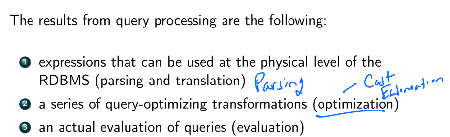
- 
  - step 1: parse/translate query into an internal form (based on relational algebra)
    - also checks syntax and whether relations exist
  - step 2: optimizer picks the most efficient query plan
    - has info on the cost associated with each operation:
      - estimated block transfers + seeks
      - num of tuples
      - current CPU/RAM state (psql uses this)
      - data transfer speed
      - disk space
      - network transfer speed
      - time
    - most important costs are block transfer time $t_T$ and seek time $t_S$
      - cost to transfer $B$ blocks and do $S$ seeks is $$Bt_t+St_S$$
  - step 3: evaluate query plan, pull data from disk, and return in a table

### Implementing the Select $\sigma$ Operator
- we can naively do a $O(n)$ full table scan to find the matches
- rule A1
  - 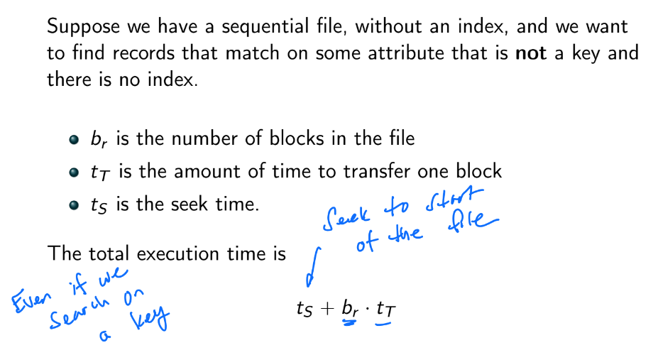
    - but if blocks are not stored contiguously, we have to do a seek for each block (in the worst case), so $$b_rt_S+b_rt_T=b_r(t_S+t_T)$$
  - what if we search on a key?
    - there will only be one match
    - worst case: key DNE or key in last block, so $$t_S+b_rt_T$$
    - best case: key is in the first block, so $$t_S+t_T$$
    - assuming uniform / symmetric distrubtion over keys, then avg complexity is $$t_S+\left(\frac{b_r}{2}\right)t_T$$
- rule A2
  - suppose relation is indexed by a primary B+ tree and search on equality with *unique key*
  - 1. traverse B+ tree from root to proper leaf node $$h(t_S+t_T)$$
  - 2. search for record pointer in block: 0 time needed since whole leaf node already in RAM
  - 3. retrive the record pointed to by the key $$t_S+t_T$$
  - so total time spent on disk I/O is $$h(t_S+t_T)+t_S+t_T=(h+1)(t_S+t_T)$$
- rule ?
  - suppose primary B+ Tree and search on a key $v$ s.t. $K\geq v$, and records stored contiguously
  - 1. find $v$ in tree and traverse to leaf node: $h(t_S+t_T)$
  - 2. seek to the first record: $t_s$
  - 3. transfer all blocks necessary as you walk linearly thru leaf nodes: $bt_T$
  - in fact, a full index scan is better than using a B+ tree like the above: $t_S+bt_T$

### Implementing Join Operations $\bowtie$
- **Nested-Loop Join**
  - 
    - pros:
      - does not require an index
      - no restrictions on join condition $\theta$ (most universal)
    - cons:
      - very SLOW: $O(n_r\cdot n_s)$
  - 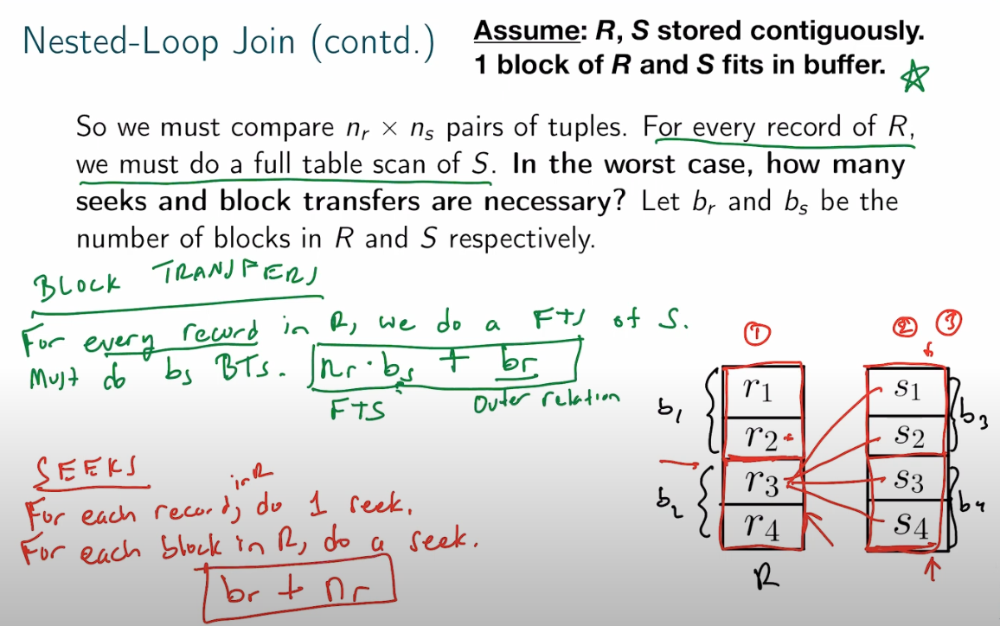
  - suppose $R$ fits entirely in main memory, its blocks are read exactly once
    - we would want $R$ to be in the inner loop
      - block transfers: $b_r+b_s$
      - seeks: $1+1=2$
    - if $R$ in the outer loop
      - block transfers: $b_r + n_rb_s$
      - seeks: $1+n_r$
  - *Block Nested-Loop Join*
    - process by blocks (that fit in RAM) instead of the whole relations
      - compare every tuple in block $B_r$ with every tuple in block $B_s$
    - 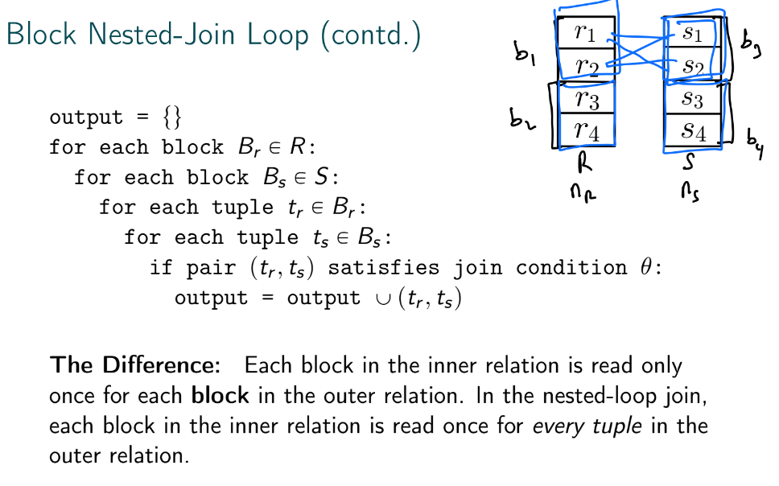
    - block transfers: $b_r+b_rb_s=b_r(b_s+1)$
    - seeks: $2b_r$
  - *Indexed Nested-Loop Join*
    - put an index on the inner relation to replace file scans of the inner relation with index lookups
      - can use an existing index or a temp one generated solely for the join (if optimizer decides it's cost efficient)
    - 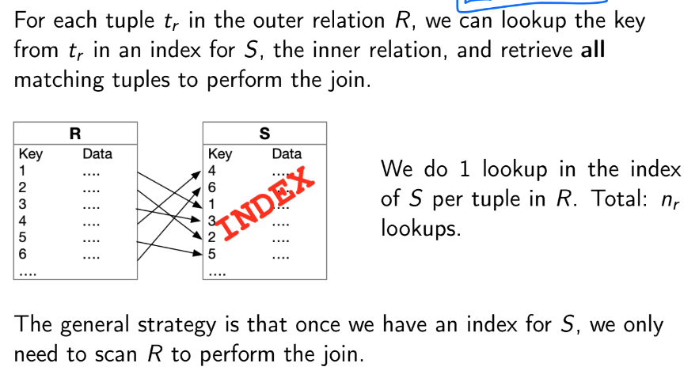
    - 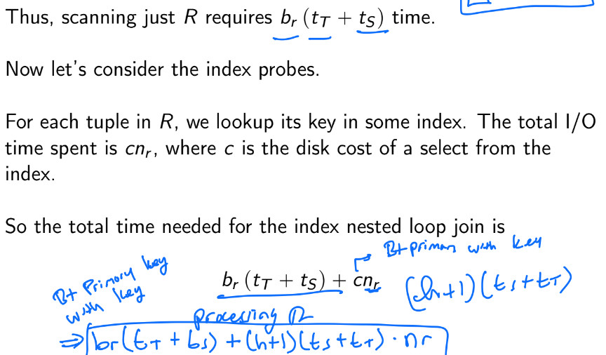
- **Merge Join**
  - 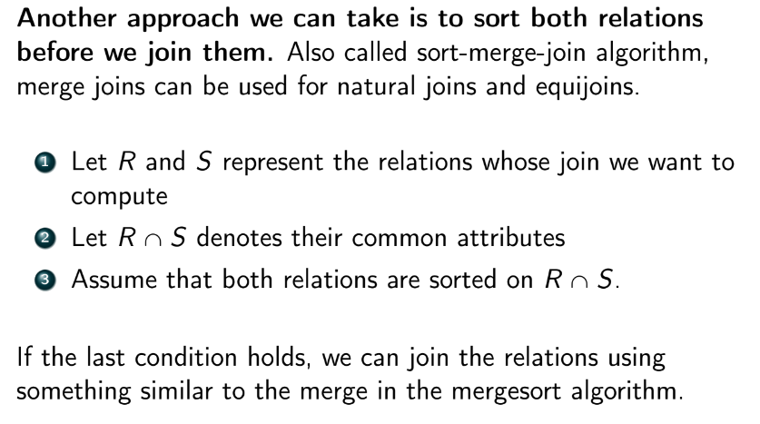
    - maintain one pointer per table and do a interleaved linear search
    - so only one full table scan for each relation
    - block transfers: $b_r+b_s$
    - seeks: proportional to the # of tiems we switch between advancing the outer pointer and the inner pointer
- **Hash Join**
  - choose one relation to be the *build side*, and the other to be the *probe side*
    - fit as many blocks from build side as possible into RAM (a window) and build a hash table from the records contained
      - FTS the probe side and see if we have hash matches
      - rinse and repeat for the next window
  - problem: hash collisions
    - if we have $|w|$ windows of blocks, we do $|w|$ FTS on probe side
    - have to post process to eliminate the hash collisions

### Joins in Spark
- 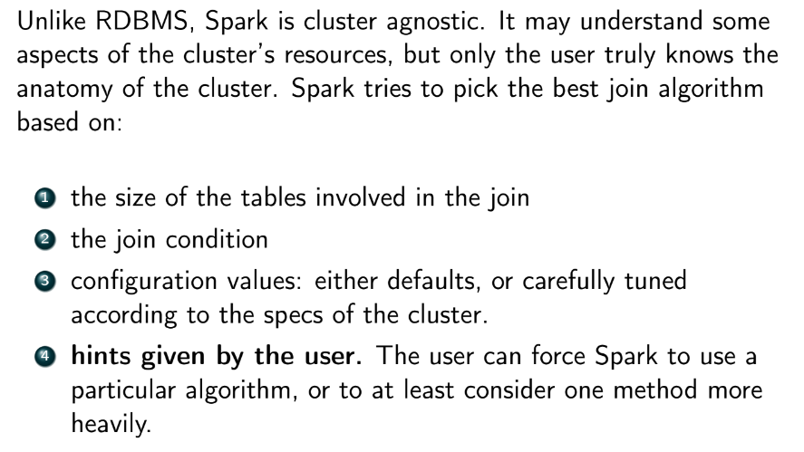
- **Broadcast-Based Joins**
  - 
  - 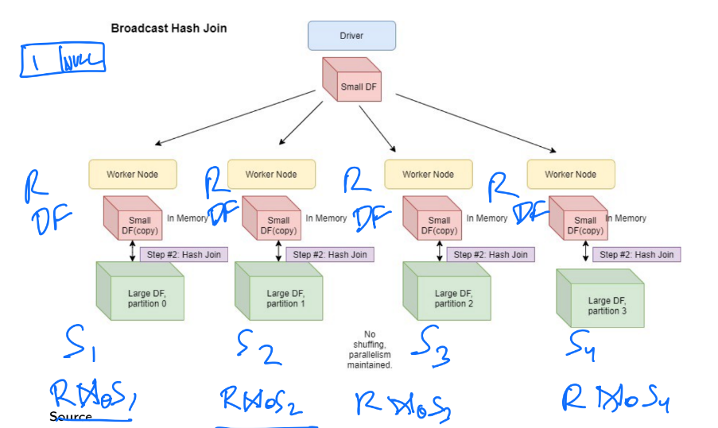
    - $R$ is the relation that fits in RAM
    - inner equi-joins are perfect for this
    - not good for outer joins bc of data locality
      - a matching key might exist in $S_2$ but not in $S_1$
        - $S_1$ still writes a NULL row despite it being completely useless
  - 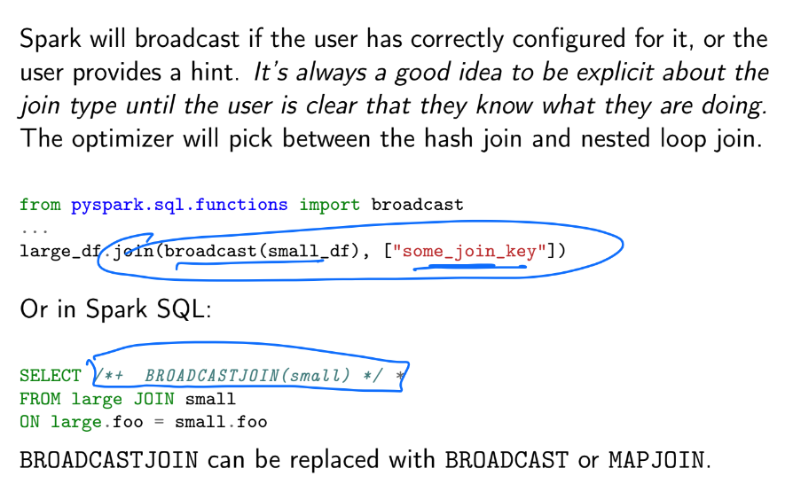
- **Shuffle-Based Joins**
  - 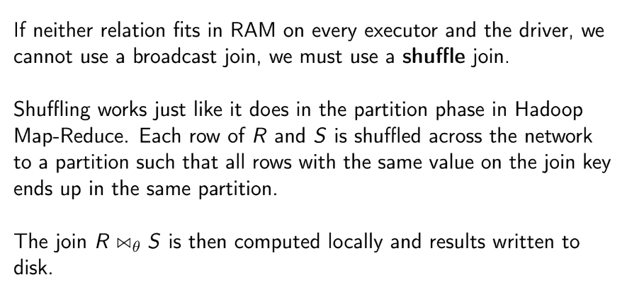
  - 
  - problem: can be heavily impacted by key skew, which overloads certain executors
    - e.g. the word "the"
  - 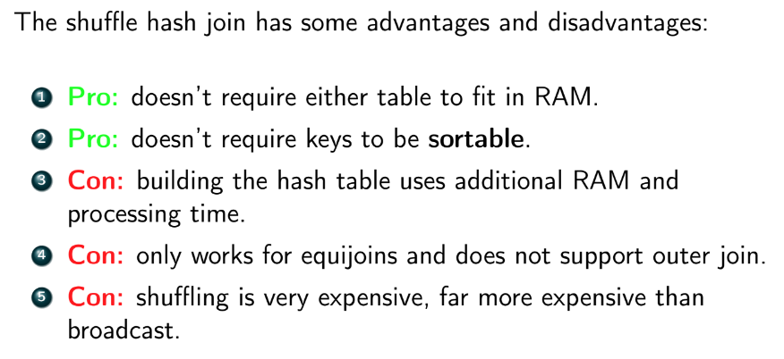
- 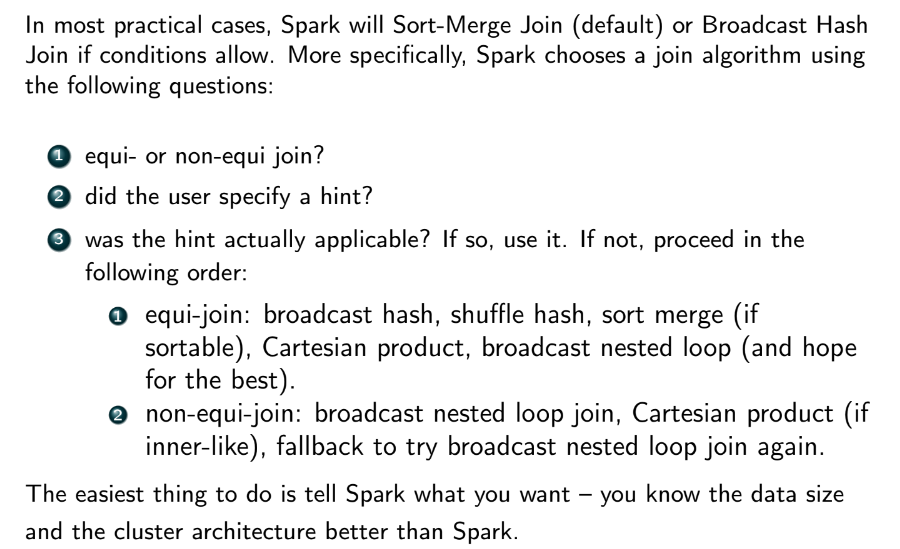