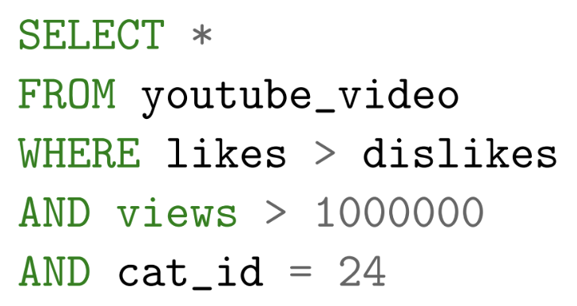
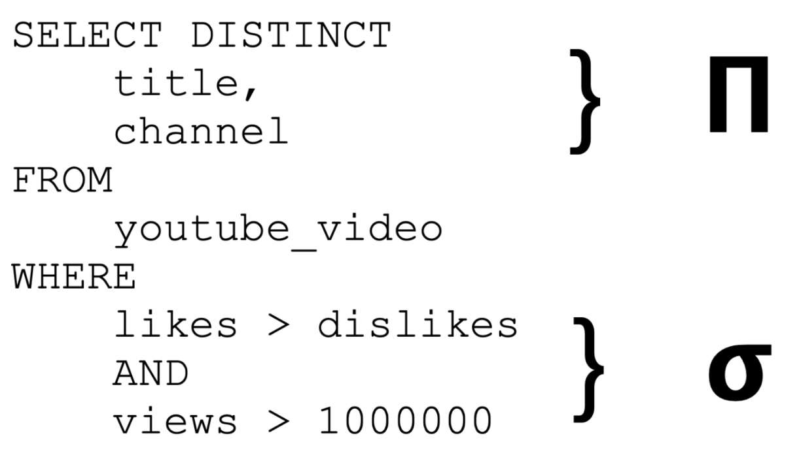
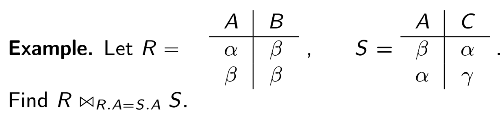
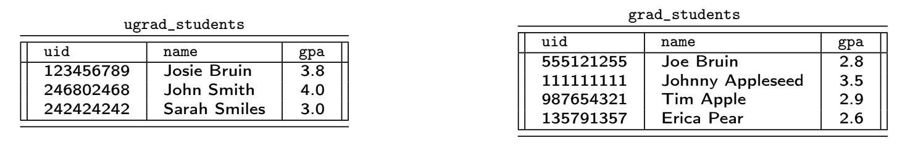
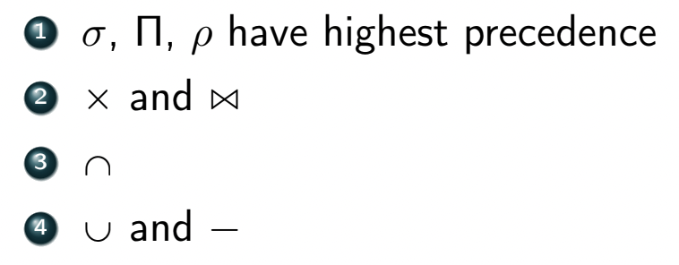

### Intro
- recall that a relation is a set of tuples
  - each tuple contains one or more named attributes
- order of tuples in a relation doesn't matter (set)
- order of attributes in each tuple must be consistent

### Common Operations on Data
- **Selection** $\sigma$
  - retrives a subset of tuples from a *single* relation that satisfies a particular constraint and returns a new relation which is a subset of the original
  - $\sigma_\psi(R) = \cbrack{t\in R:\psi(t)}$
    - $\psi$ is a predicate that compares two attributes or an attribute and a value using a binary operator
      - we can build complex predicates using conjunction $\land$ and disjunction $\lor$
  - SQL WHERE acts as a filter
    - 
    - we can write it in relational algebra as $$\sigma_{l>d\land v>1M\land c=24}(R)$$
    - *note:* $\sigma\neq SQL\ SELECT$
    - similar to SELECT * FROM $R$ WHERE $\psi$
- **Projection** $\Pi$
  - extracts subsets of attributes from relations and removes duplicates
  - $\Pi_{a_1,\dots,a_n}(R)=\cbrack{t[a_1,\dots,a_n]:t\in R}$
  - $\Pi=SQL\ SELECT\ DISTINCT$
  - can be generalized to "create" new attributes using the $\to$ notation
    - apply arbitrary expressions to attributes
      - $\Pi_{likes/(likes+dislikes)}$
    - apply arbitrary expressions to create new columns
      - $\Pi_{likes+dislikes\to interactions}$
    - rename attributes
      - $\Pi_{thumbs\_up\to likes}$
    - generalized $\Pi\approx$ SQL AS 
  - if we want all attributes, just use $\sigma$ and not use $\Pi$
  - ex.
    - write a relational algebra to extract the title and channel for all videos that have more than 1 million views and more likes than dislikes
    - $\Pi_{title, channel}(\sigma_{v>1M\land l>d}(R))$
    - the SQL equivalent is SELECT DISTINCT
      - 
  - there can be more than one correct way to chain together operations
- **Cartesian Product** $\times$
  - forming all pairs of possible ordered tuples between two relation
  - $R\times S=\cbrack{r\cup s:r\in R\land s\in S}$
  - in practice you would rarely use the Cartesian product
    - very slow and memory intensive
    - we mostly use it to motivate the *join*
- **Join**
  - we perform joins to merge tuples from two different relations based on some contextually related attribute(s) in both relations
  - results in another relation where each tuple contains data from the tuples of both relations that were joined
  - *join key* - the sets of related attributes that are used to join the two relations
    - has nothing to do with uniqueness
    - FK can be JK but FK $\neq$ JK
  - every join is a natural join or a theta join
  - **Natural Join** $\bowtie$
    - the RDBMS *automatically* picks the attribute(s) $k$ to join on - the attribute names common to both relations
      - RDBMS identifies join key as *any attribute that is present in both relations and has the same name*
      - we get one copy of the join key in the output
      - we only discuss the case where the output only includes tuples that have a match in both relations (**inner**)
    - $$\aligned{R\bowtie S &= \Pi_{R\cup S}(\sigma_{R.k=S.k}(R\times S)) \\ &= \cbrack{r\cup s:r\in R\land s\in S\land r[k]=s[k]} }$$
    - Edge Cases:
      - joining two relations $R,S$ that have no common attributes
        - $k=\empty\implies r[k]=s[k]=\empty$ so the predicate is always true
        - thus $R\bowtie S=R\times S$
      - joining two relations $R,S$ that have common attributes but no mataches on those attributes
        - $r[k]=s[k]$ is never true $\implies R\bowtie S=\empty$
    - tuples are combined using equality of values in the common attributes
      - thus natural join AKA *equijoin*
  - **Theta Join** $\bowtie_\theta$
    - enforces an additional constraint $\theta$ on the natural join
      - we get two copies of the join key (even if names are different)
      - $R\bowtie_\theta S=\sigma_\theta (R\times S)=\cbrack{r\cup s:r\in R\land s\in S\land \theta(r\cup s)}$
    - *alias* - we must use modified names for attribute names that are common to both relations
      - prefix attribute name with the relation name
    - 
    - theta joins are much more general and powerful compared to natural joins
    - if $\theta$ consists entirely of equality constraints, it is called an *equijoin*
      - otherwise it's a *non-equijoin*
- **Aggregation** $\gamma$ or $\mathcal{G}$
  - uses an aggregation function to a group of tuples in a relation to summarize them
  - common aggregation functions:
    - SUM
    - AVG
    - MIN
    - MAX
    - DISTINCT-COUNT
  - we ignore NULL values
  - Notation:
    - $_\text{attributes to group by}\gamma_\text{functions to apply}(Relation)$
  - examples:
    - average GPA of each major:
      - $_{major} \gamma_{AVG(gpa)\to major\_averages}(students)$
    - global average GPA:
      - $\gamma_{AVG(gpa)\to bruin\_average}(students)$
    - average GPA and average sleep of each major
      - $_{major} \gamma_{AVG(gpa),AVG(sleep)}(students)$
- **Rename** $\rho$
  - used to rename relations, attributes, or relational algebra subexpressions (of a bigger complex expression)
  - Notation:
    - $\rho_S(R)$ renames relation (or expression) $R$ to $S$
      - $\rho_{new}(old)$
    - $\rho_{a/b}(R)$ renames attribute $b$ in relation $R$, to $a$
      - $\rho_{new/old}(R)$
    - special case: in the Cartesian product, $R\times R$ is not valid - we must alias one side as $\rho_L(R)\times R$
  - recall that the Projection operater $\Pi$ can also be used to rename attributes
    - $\Pi_{old\to new}$
  - Remark: $\rho$ does **not** change the underlying data (just outputs a temp view)
- **Set Theory Operations**
  - when performing a set theory operation in relational algebra, the 2 sets must be *compatible*, i.e. they both must have the same
    - number of attributes
    - attribute names
    - domain for each attribute
  - **Set Union** $\cup$
    - $R\cup S$ contains all tuples that are in $R$, in $S$, and in both $R$ and $S$ (discarding duplicates)
      - $R\cup S = \cbrack{r_1,\dots,r_{|R|},s_1, \dots, s_{|S|}}$
    - example:
      - imagine two relations $R,S$ stored on different machines
        - have to send tuples to computation node
      - 
      - write an expression that yields the name of all students that have a GPA $\geq 3.0$
      - 3 ways to write this
      - 1. $\Pi_{name}(\sigma_{gpa\geq 3.0}(R\cup S))$
      - 2. $\Pi_{name}(\sigma_{gpa\geq 3.0}(R)\cup \sigma_{gpa\geq 3.0}(S))$
      - 3. $\Pi_{name}(\sigma_{gpa\geq 3.0}(R))\cup \Pi_{name}(\sigma_{gpa\geq 3.0}(S))$
      - the 3 ways progressively use less and less network I/O
    - example:
      - 
      - we can use $\rho$ to make it work
      - $\rho_{gpa/ugrad\_ gpa}(R)\cup \rho_{gpa/grad\_ gpa}(S)$
  - **Set Intersection** $\cap$
    - $R\cap S$ retrives all tuples that are in both $R$ and $S$
      - $R\cap S=\cbrack{t:t\in R\land t\in S}$
  - **Set Difference** $-$
    - $R-S$ retreives every tuple in $R$ that are not in $S$
      - $R-S=\cbrack{t\in R:t\not\in S}$
    - similar to SQL EXCEPT
- Order of Precedence
  - 
- Properties of Operators
  - 