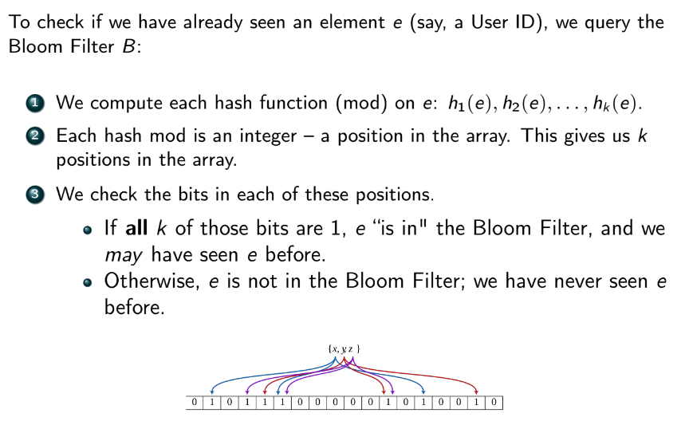

### Streaming Data Systems
- real time
- up to this point we have talked about:
  - RDBMS/OLTP
  - OLAP/Data Warehouses
  - Batch Processing systems (MapReduce / Spark)
  - these systems work on *complete* and *bounded* data
    - store and have access all data
      - thus can produce results deterministally
- what about unbounded data?
  - data arrives as it is produced
  - dataset *never* complete
  - must use **stream processing**
    - must consider velocity and volume
- 
- **Lambda architecture** - processes massive quantities of data by using both batch and realtime/stream processing (speed)
- examples of streams:
  - stdin, stdout
  - pipes reamd streams and redirect them to other ps
  - TCP connections
  - realtime audio/video
  - constant sensor measurements
  - realtime data such as tweets, stock prices, sports info, activity in video game
- work with individual records, called **events** or **messages**
  - each event partially identified with a timestamp
    - written once but may be read multiple times
    - may have a key associated with it
  - want to act on data as it arrives shortly after, *not* long after
  - don't want to store in RDBMS since the massive amount of writes may lock up db
- two ends / "taps" for processing events
  - **producer** (or pbulisher, sender) - creates an event or msg
  - **consumer** (subscriber, recipient) - receives + processes OR hands off a msg from producer
- can have producers publish (write) to RDBMS and have subscriber poll routinely for new data
  - but this is inefficient and high latency
  - better to use a push model than a pull model
- most rudimentary model is to directly connect producers and consumers (like a bipartite graph)
  - problems:
    - producers must be hardcoded to consumers
    - producers are all independent (if one becomes unavailable others don't know to help)
    - producers can transmit data faster than consumers can process
- **message broker** - sits in the message bus between publishers and subscribers
  - communicates with both pub and sub
    - handles the case where pub/sub come and go
      - maintains state and spins up new pub/sub with minimal delay
  - publishers send msgs to brokers
  - subscribers read msgs from the broker
  - broker has a queue of messages and try to dispatch them to consumers
    - if consumer receives and sends back ACK, delete msg from queue
      - same with producer -> broker
      - consumer does not send ACK until it finishes *processing* the msg
        - since something can go wrong during processing
    - two phase commit (2PC) - producer only deletes msg once the consumer sends ACK to broker, which is then forward to the producer as a special commit ACK (full round trip ACK)
      - this is an optional guarantee
      - useful when pub can't trust broker/sub
  - what if broker gets overwhelmed?
    - can apply flow control or spin up more consumers
    - if we are willing to tolerate some msg loss, we can delete the oldest msgs in queue, or at random
      - for former: think twitter trending topic
      - for latter: think computing running aggregates
- all consumers are not necessarily made equally
  - how does broker determine which one gets msg?
    - **load balancing** - broker chooses one consumer to receive the msg arbitrarily o rbased on some shard
    - **fan-out** - aka broadcast; broker delivers the msg to ALL consumers in particular groups
      - each node may do something different with the message
      - similar to multiplexing (dual writes)
- sources of msg loss
  - loss networks
  - pub/sub offline
  - sub goes down **ungracefully** (no one knows it went down, e.g. power loss)
  - broker goes down (sol: backup brokers)
  - broker/pub/sub overflows with msgs
- there's a TTL on messages that after expiration, we no longer care about msg (can delete)
- 
- 
- 
- 

### Processing Streaming Data
- what can we do with streams?
  - 
- **computing aggregates of streams**
  - typically process data either over a particular window $w$ of time, or over all time
  - aggregates could be approximations or exact
  - idea: the consumers, or stream processing system, maintain a memory buffer containing a fixed number of messages
    - then compute aggreagtes either
      - over parts (windows) of the buffer
      - at specific time intervals over the entire buffer
  - different ways to construct computation windows
    - **tumbling window** - non-overlapping windows of time (consecutive)
    - **hopping window** - fixed length period, but time periods overlap
      - the better approach
      - gives us some continuity and eliminates hard breaks
      - smoother running average
    - **sliding window** - constructed within some time period $\epsilon$ around each event
    - **session window** - defines an entire session from first event of a particular type, to the last event
      - inefficient and similar to RDBMS
- how to handle stragglers?
  - i.e. data that should've been in the previous window but arrived late
  - we can either
    - ignore stragglers
    - keep previous window open for a while to capture stragglers
    - if we store metric associated with prev window, we can correct the metric later
      - only works with an updatable statistic
        - easy: count, min, max, avg, std
          - e.g. for avg we want to save the running sum and the count $n$
            - sum = sum + new
            - n += 1
            - mean = sum / n
        - hard: median, percentile
    - we can just include straggler in current window's calculations
- 
- **special aggregations and data management on streams**
  - set containment and duplicate removal
    - trivial to solve with a set, but does not scale
      - tradesoff memory with perfect accuracy
    - **bloom filter** - a probabilistic data structure that may return the wrong answer
      - defined as a bit string of length $m$ and associated with $k$ hash functions
      - 
      - 
      - hash collisions can cause false positives
      - want low ratio of hash function to $m$
      - want to control # of entries $n$ into Bloom filter
      - $$P(FP) = (1-e^{-kn/m})^k$$
  - count distinct
    - **HyperLogLog** - similar to Bloom Filter except we treat bitstring as a binary number
      - use run lenghts and probability to provide an estimate of the cardinality of a set
      - amazing space complexity
        - can count ~4 billion distinct elements using only 5 bits
      - asymptotically, HyperLogLog has an avg error of only 2% on cardinality estimates