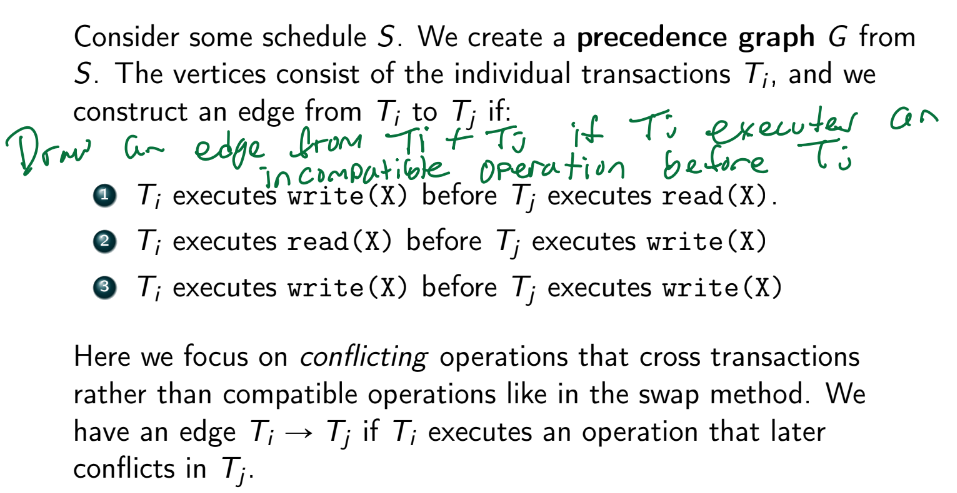
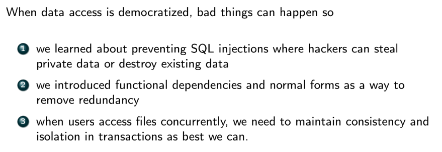

### Transactions and Commits
- with auto-commit on, queries will be executed to the DB immediately
- with auto-commit off, nothing will be written until you use the `COMMIT` command
- 
- transactions are *atomic*
  - either all of the operations in transaction are completed successfully + committed to the RDBMS, or none of them are
    - if error occurs during transaction, it aborts, and all changes are *rolled back*
      - errors include: data integrity failure, constraint failure, other errors (division by zero), disk failure, system/power outage, etc
    - statements and operations are held in a buffer before `COMMIT` is called
- transactions must maintain database *consistency*
  - consistency - maintain some constraint on the data s.t. we do not end up with more/less data than we started with
- *isolation* - concurrent transactions operate independently and does not interfere with each other
  - maximizes consistency in the face of concurrency
- *durability* - once transaction is committed, the data must be safe from system failures

### ACID
- transactions are ACID compliant if they guarantee the following:
  - 
- provides high consistency
- RDBMS **must** maintain ACID guarantees
  - most NoSQL DBs do not

### BASE
- Basically Available Soft-state Eventually consistent
  - provides high availability and eventual consistency
    - e.g. Cassandra's gossip model
  - *soft-state* means we don't actually know when the data will be consistent
- NoSQL transaction satisfy this
  - since NoSQL often distributed, not able to be always consistent 100%
- transaction model guarantees BASE if it guarantees the following
  - 

### Strict ACID
- 
- airplane seating example:
  - 
  - let S1 be old seat and S2 be new seat
    - want to mark S1 as false and S2 as true
    - ```
        Transaction
        read(S1)
        S1 = false
        write(S1)
        read(S2)
        S2 = true
        write(S2)
        commit
        ```
-  
-  
-  
-  *concurrency* is multiple transactions sharing a resource (interleavingly) while *parallelism* is two transaction literally execute at the same time (e.g. on multicore CPU)
-  a schedule of trqansactions is *serial* if each transaction executes fully before another begins
   -  no interleaving operations
   -  *guarantees* consistency, but little concurrency
      -  concurency reduces waiting time => improves throughput
-  *conflict serializable schedule* - the schedule is either serial, or it is equivalent in result to a serial scheudule
   -  if a concurrent schedule can be converted to one that is serial, the schedule is *serializable*
      -  *guarantees consistency!*
   -  not serializable means MAY be inconsistent (not ALWAYS inconsistent)
   -  
   -  
-  **Precendence Graph**
   -  
   -  
   -  


### Isolation Levels
- decreasing isolation will decrease consistency, but increase concurrency
- 4 isolation levels from strongest to weakest:
- **Serializable**
  - little concurrency => poor performance, max consistency
  - must be equivalent in result to a serial schedule
- **Repeatable Read**
  - if $T_i$ reads X, it puts a lock on it so no other transaction $T_j$ can update it
  - requires a lot of locking
  - this is the default in MySQL
- **Read Committed**
  - $T_i$ can *only* read data from another transaction $T_j$ that has already committed it
  - the default in all other RMDBS
- **Read Uncommitted**
  - $T_i$ can read data from *any* other transaction even if it's not committed
- problems:
  - dirty write
    - T1 updates a value and then T2 changes the value before T1 commits
    - cannot ever happen under any isolation level
  - dirty read
    - transaction can read uncommitted changes (from shared memory buffer) from other transactions
    - only the *read uncommitted* iso level allows this
    - 
  - fuzzy read / non-repeatable read
    - occurs when T1 reads a value, then T2 updates the value and commits, then T1 reads the value but sees a different one than before
    - only occurs in *read uncommitted* and *read committed* modes
    - 
  - phantom read / phantom phenomenon
    - occurs when T2 *inserts or deletes* rows on a table in between two SELECTS of T1
      - only applies to a set of records, not just one record
    - can happen in *read uncommitted*, *read committed*, and *repeatable read*
    - 
  - 

### Locking for Isolation
- most common way of ensuring consistency under concurrency
  - e.g. repeatable read will put lock on data so that no other transaction can modify it during read
- *shared lock* - allows read access
  - multiple transactions can hold shared locks on a single record X
  - must wait for all shared locks to be released if you want to write
- *exclusive lock* - allows read/write access
  - no other transactions can update (will block instead)
- *starvation*
  - 
  - 
  - transaction only gets lock to an item if there are no locks on it, or there are no other requests for a lock on it
    - otherwise transaction will block

### Two-Phase Locking (2PL)
- 
- each transaction pulls locks on data it needs => no other transaction can modify those values

### Deadlocks
- 
- 

### Lock Manager
- receives lock/unlock requests and returns either a grant for a lock or an indicator to block
  - unlock request usually returns just ACK, but sometimes has side effect of granting another lock request
- lock requests stored in hash table called *lock table*
  - key is data value, points to link list of transactions that are waiting for lock
- lock manager can *prevent* deadlocks
  - detects deadlocks that are about to occor using a wait-for graph
    - tells the transaction to rollback
- approaches to prevent deadlocks:
  - 
- detection of and recovery from deadlocks
  - 

### Summary
- 

### Transactions in NoSQL
- **Redis**
  - 
  - WATCH keys to basically lock them
  - 
  - 
- **MongoDB**
  - 
  - 
- **neo4j**
  - 

### Summary of Class
- 
- 
- 
- 
- 